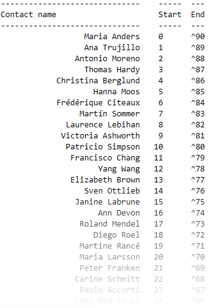
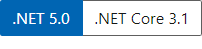

# C# 8 Ranges and Indices

Ranges and indices provide a succinct syntax for accessing single elements or ranges in a sequence.

 :heavy_check_mark: Write-up article

 

# Microsoft docs

[Explore indexs and ranges](https://docs.microsoft.com/en-us/dotnet/csharp/whats-new/tutorials/ranges-indexes)

# See also

[Original GitHub page](https://github.com/karenpayneoregon/karenpayneoregon.github.io/blob/master/csharp/indices-ranges.md)