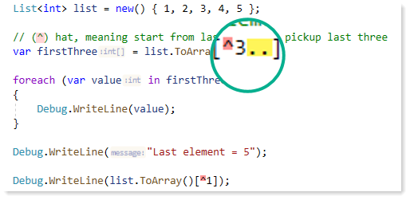
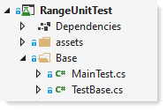

# C# 8 Ranges and Indices in detail

 

---



Learn how to work with C# 8 Range and Indexes going beyond the code samples found done by Microsoft and other entities on the web.

There are code samples that work with

- Strings
- Dates
- Numerics
- Classes/list

Each code sample are done in unit test methods where the category/trait for each are marked with `[TestTraits(Trait.xxxx)]` where xxxx has been defined in the following `enum`.

```csharp
public enum Trait
{
    PlaceHolder,
    RangesIndices,
    CreateTextFile,
    Contacts,
    Cities,
    Strings,
    Dates,
    Numbers
}
```

# Documentation

- Each unit test describes it's intent and verified with assertions.
- Some test use [IEqualityComparer](https://docs.microsoft.com/en-us/dotnet/api/system.collections.generic.iequalitycomparer-1?view=net-5.0)&lt;T&gt; to compare actual results with expected results as shown below.

```csharp
using System;
using System.Collections.Generic;

namespace RangeUnitTest.Classes
{
    public class ContactIdFirstNameLastNameEqualityComparer : IEqualityComparer<Contacts>
    {
        public bool Equals(Contacts x, Contacts y)
        {
            if (ReferenceEquals(x, y)) return true;
            if (ReferenceEquals(x, null)) return false;
            if (ReferenceEquals(y, null)) return false;
            if (x.GetType() != y.GetType()) return false;
            return x.ContactId == y.ContactId && x.FirstName == y.FirstName && x.LastName == y.LastName;
        }

        public int GetHashCode(Contacts obj)
        {
            return HashCode.Combine(obj.ContactId, obj.FirstName, obj.LastName);
        }
    }
}
```

</br>

# Data sources

For many of the code samples, information is read from text files

- Using json

``` csharp
using System;
using System.Collections.Generic;
using System.IO;

namespace RangeUnitTest.Classes
{
    public class MockedData
    {
        public static string ContactFileName { get; } = "contacts.json";

        public static List<Contacts> ReadContacts()
        {
            try
            {
                var json = File.ReadAllText(ContactFileName);
                return JSonHelper.ConvertJSonToObject<List<Contacts>>(json);
            }
            catch (Exception)
            {
                return null;
            }

        }
    }

}
```

- Reading plain text

```csharp
using System.IO;
using System.Linq;

namespace RangeUnitTest.Classes
{
    public class FileOperations
    {
        public static string[] OregonCities() => File.ReadAllLines("OregonCityNames.txt");
        public static string[] OregonCitiesFirstTen() => OregonCities().Take(10).ToArray();
    }
}
```

# Base classes/Interfaces

To keep test methods clean, base classes, partial classes and Interfaces are used.



# Visualization

To get a visual representation of indices on a list see the files under the `Dump` folder in tangent with various test methods.


# Example test method

```csharp
[TestMethod]
[TestTraits(Trait.Contacts)]
public void BetweenContacts_1()
{
    /*
     * First contact for between
     */
    var firstContact = new ContactName() { FirstName = "Frédérique", LastName = "Citeaux" };

    /*
     * Last contact for between
     */
    var lastContact = new ContactName() { FirstName = "Elizabeth", LastName = "Brown" };

    var contactsArray = MockedData.ReadContacts().ToArray();
    var contacts = contactsArray.ContactsListIndices();

    var (startIndex, endIndex) = contacts.BetweenContacts(firstContact, lastContact);

    var contactsBetweenTwo = contactsArray[startIndex..endIndex];
    
    Assert.IsTrue(
        contactsBetweenTwo
            .SequenceEqual(
                ExpectedContacts, 
                    new ContactIdFirstNameLastNameEqualityComparer()));

}
```

---


**From Microsoft**

Ranges and indices provide a succinct syntax for accessing single elements or ranges in a sequence.

An index expression typically returns the type of the elements of a sequence. A range expression typically returns the same sequence type as the source sequence.


# Microsoft docs

[Explore indexs and ranges](https://docs.microsoft.com/en-us/dotnet/csharp/whats-new/tutorials/ranges-indexes)

# See also


[Visual Studio: Different methods to display unit test](https://social.technet.microsoft.com/wiki/contents/articles/51303.visual-studio-different-methods-to-display-unit-test.aspx)

[Get started with Live Unit Testing](https://docs.microsoft.com/en-us/visualstudio/test/live-unit-testing-start?tabs=csharp&view=vs-2019)

[Original GitHub page](https://github.com/karenpayneoregon/karenpayneoregon.github.io/blob/master/csharp/indices-ranges.md)